# 第一章 基础知识
## 1.1 机器语言  
机器语言是机器指令的集合。  
机器指令是让一台机器可以正确执行的命令。  
## 1.2 汇编语言
1. 产生：
    - 为了解决机器语言难以识别与记忆的问题。  
3. 组成：（三类指令）  
    1. 汇编指令：机器码的助记符，有对应的机器码。  
    2. 伪指令：没有对应的机器码，由编译器识别，计算机并不执行。  
    3. 其他符号：由编译器识别，没有对应的机器码，如“+、-、\*、/”等。  
    **汇编语言的核心是汇编指令**。  
通过编译器，就可以将汇编指令编译为机器语言，从而使计算机运行，如图1.1所示1：
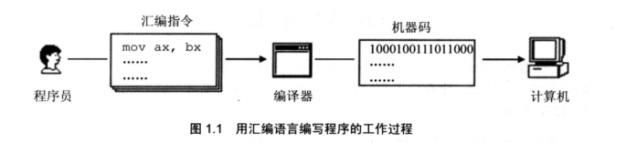

## 1.3 存储器
CPU是计算机的核心部件，它控制整个计算机的运作并进行运算。  
要想让一个CPU工作，就必须向它提供指令和数据。  
指令和数据在存储器（内存）中存放。  

## 1.4 指令和数据
指令和数据是应用上的概念。  
在内存或磁盘中，指令和数据没有任何区别，都是二进制信息。  
例如内存中的二进制信息1000100111011000既可以认为是数据也可以认为是指令：  
$${1000100111011000 \rightarrow 89D8H (DATA)}$$
$${1000100111011000 \rightarrow MOV AX, BX (INSTRUCTION)}$$  

## 1.5 存储单元
存储器被划分为若干个存储单元，每个存储单元从0开始顺序编号。  
例如，有一个存储器有128个存储单元，编号从0~127，如图1.2所示：  
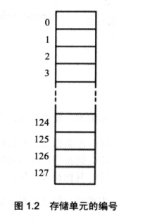  
每个存储单元大小为1Byte，即图1.2中存储器可以存储128Bytes。  

## 1.6 CPU对存储器的读写
CPU要想进行数据的读写，必须和外部器件进行3类信息的交互：
- 存储单元的地址（**地址信息**）
- 器件的选择，读或写的命令（**控制信息**）
- 读或写的数据（**数据信息**）  

CPU专门连接其他芯片的导线，被称为**总线**，总线从逻辑上分为三类：
- 地址总线
- 控制总线
- 数据总线

CPU从内存3号单元中读取数据的过程，如图1.3：  
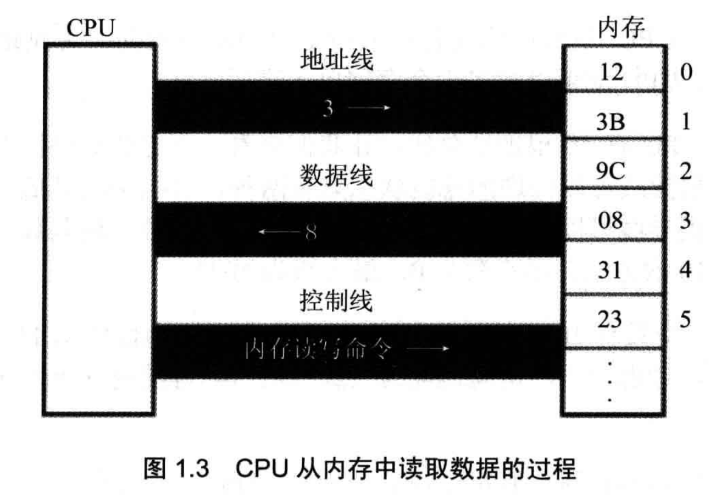  
图中操作流程为：
1. CPU通过地址线将地址信息3发出；
2. CPU通过控制线发出内存读命令，选中存储器芯片，并通知它，将要从中读取数据；
3. 存储器将3号单元中的数据8通过数据线送入CPU。

## 1.7 地址总线
1个CPU有N根地址线，则可以说这个CPU的地址总线宽度为N。这样的CPU最多可以寻找2的N次方个内存单元。  
图1.4展示了一个具有10根地址线的CPU向内存发出地址信息“11”时10根地址线上传送的二进制信息：  
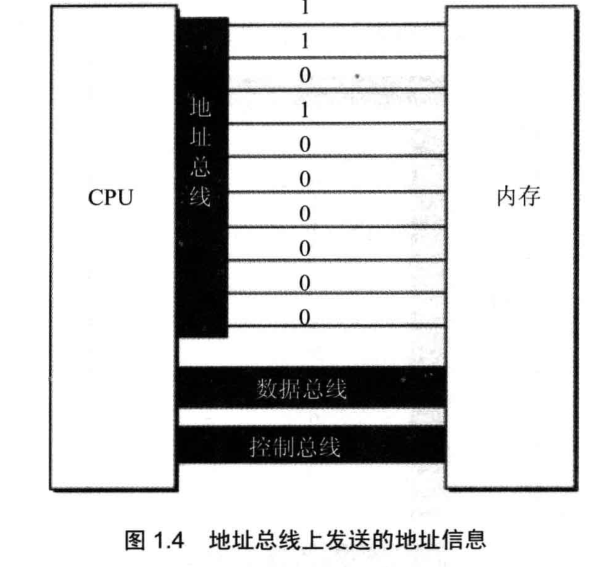  

## 1.8 数据总线
类似于地址总线，1个CPU有N根数据线，则可以说这个CPU的数据总线宽度为N。这样的CPU一次最多可以传送N个位。  
8088CPU的数据总线宽度为8，8086CPU数据总线宽度为16，图1.5展示了8088CPU数据总线上的数据传送情况；图1.6展示了8086CPU数据总线上的数据传送情况：  
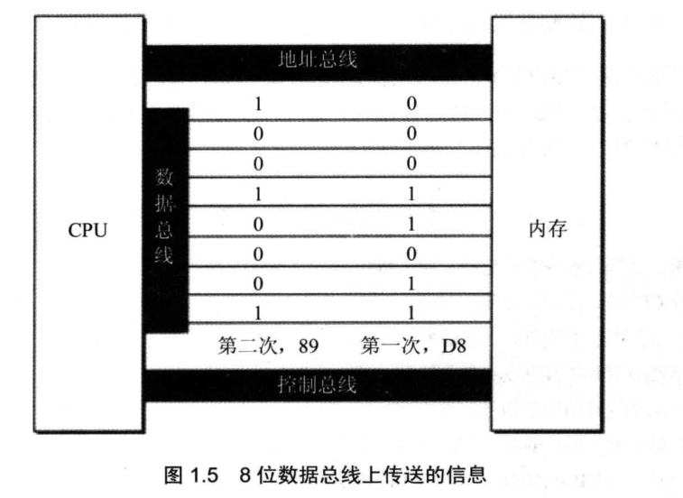  
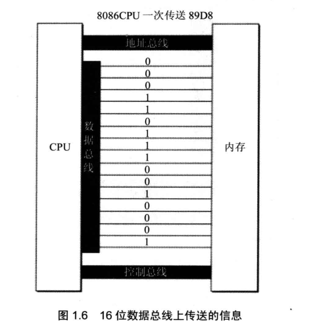  

## 1.9 控制总线
CPU对外部器件的控制是通过控制总线来进行的，***有多少根控制总线，就意味着多少种控制***。  

## 1.10 主板
在每一台PC机中，都有一个主板，主板上有核心器件和一些主要器件，这些器件通过总线（地址总线、数据总线、控制总线）相连。这些器件有CPU、存储器、外围芯片组、扩展插槽等。扩展插槽上一般插有RAM内存条和各类接口卡。  

## 1.11 接口卡
CPU对外部设备都不能直接控制，如显示器、打印机等。  
直接控制这些设备进行工作的时插在扩展插槽上的接口卡。  
扩展插槽通过总线和CPU相连，所以接口卡也通过总线同CPU相连。

## 1.12 各类存储器芯片
一台PC机中，装有多个存储器芯片，这些存储器芯片从物理连接上看是独立的，不同的器件。  
从读写属性上看分为两类：
1. 随机存储器（RAM）：可读可写，但必须带电存储，断电易失数据；
2. 只读存储器(ROM)：只能读取不能写入，断电不会丢失数据。

存储器从功能和连接上又可分为：
1. 随机存储器：用于存放供CPU使用的绝大部分程序和数据，主随机存储器一般有两个位置上的RAM组成，装在主板上的RAM和扩展插槽上的RAM；
2. 装有BIOS的ROM：由主板和各类接口卡（显卡、网卡等）提供的软件系统，可以通过它利用该硬件进行最基本的输入输出；
3. 借口卡上的RAM：某些借口卡需要对大批量输入、输出数据进行暂时存储，在其上装有RAM，如显卡的显存。

图1.7展示了PC系统中各类存储器的逻辑连接情况：
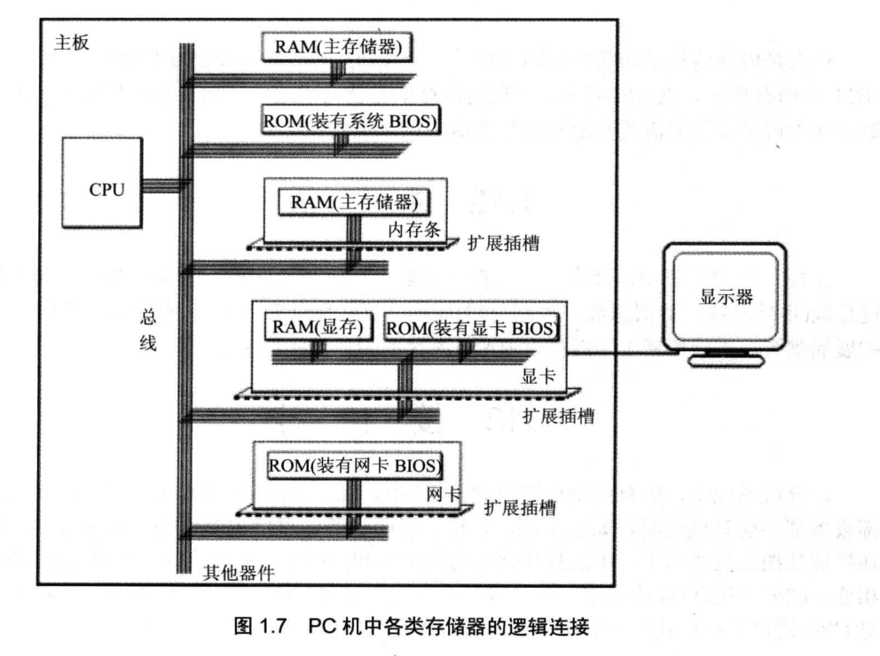  

## 1.13 内存地址空间
上述的存储器，在物理上是独立的器件，但在以下两点上是相同的：
1. 都与CPU的总线相连；
2. CPU对它们进行读或写的时候都通过控制线发出内存读写命令。  

也就是说，CPU在操控它们的时候，都将他们当作内存来看待，把它们总的看作一个由若干存储单元组成的逻辑存储器，这个逻辑存储器即**内存地址空间**。  
图1.8展示了CPU将系统中各类存储器看作一个逻辑存储器的情况：  
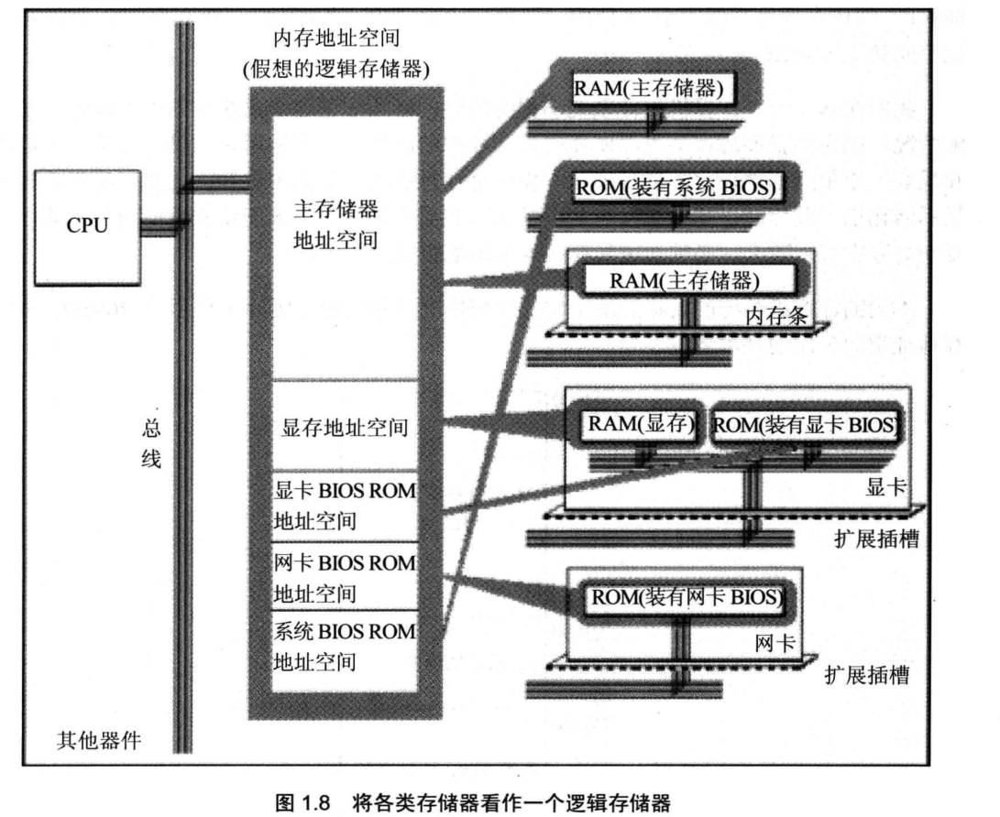  
在图1.8中，所有物理存储器被看作一个由若干存储单元组成的逻辑存储器，每个物理存储器在这个逻辑存储器中占有一个地址段，即一段**地址空间**。  
CPU在这段地址空间中读写数据，实际上就是在相对应的物理存储器中读写数据。  
不同计算机系统的内存地址空间的分配情况是不同的，图1.9展示了8086PC机内存地址空间分配的基本情况：  
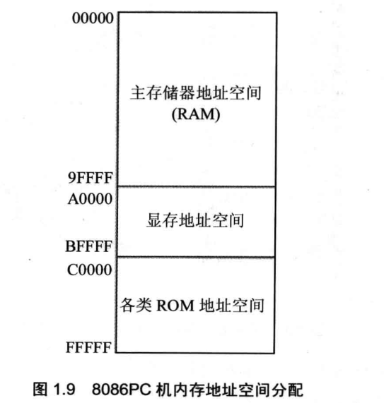

# 第二章 寄存器
一个典型CPU由*运算器*、*控制器*、*寄存器*等器件构成，这些器件通过内部总线相连。  
在CPU中：
- 运算器进行信息处理；
- 寄存器进行信息存储；
- 控制器控制各种期间进行工作；
- 内部总线连接各种期间，在它们之间进行数据的传送。

对于汇编编程来说，CPU的主要部件是寄存器，寄存器是CPU中可以用指令读写的部件。  
8086CPU有14个寄存器：
- AX
- BX
- CX
- DX
- SI
- DI
- SP
- BP
- IP
- CS
- SS
- DS
- ES
- PSW

## 2.1 通用寄存器
8086CPU的所有寄存器都是16位的，可以存放两个字节。  
AX、BX、CX、DX这四个寄存器通常用来存放一般性的数据，被称为*通用寄存器*。  
以AX为例，寄存器的逻辑结构如图2.1所示。
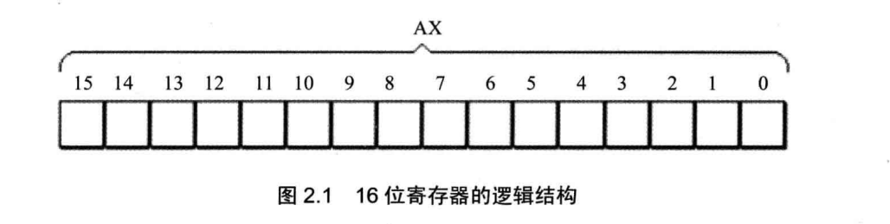  

一个16位寄存器能够存储一个16位的数据，数据在寄存器中存放情况如图2.2所示。
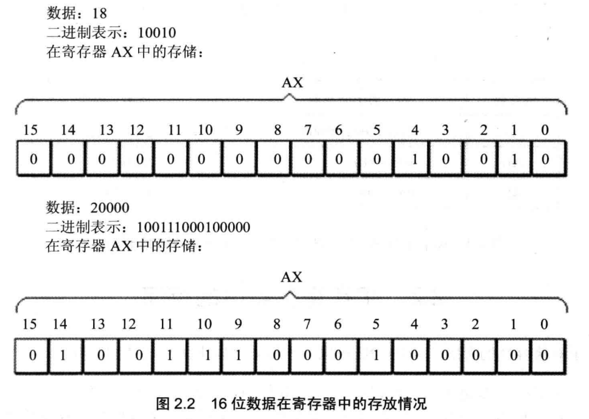  

为保证兼容性，8086CPU的AX、BX、CX、DX这四个寄存器都可分为两个独立使用的8位寄存器使用：
- AX可分为AH和AL；
- BX可分为BH和BL；
- CX可分为CH和CL；
- DX可分为DH和DL。

以AX为例，8086CPU的16位寄存器分为两个8位寄存器的情况如图2.3所示。
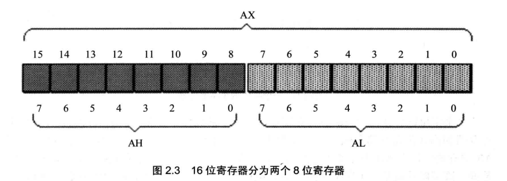  

AX的低8位（0-7位）构成了AL寄存器，高8位（8-15位）构成AH寄存器。  
AH和AL寄存器可以是独立使用的8位寄存器。  
图2.4展示了16位寄存器及它所分成的两个8位寄存器的数据存储的情况。
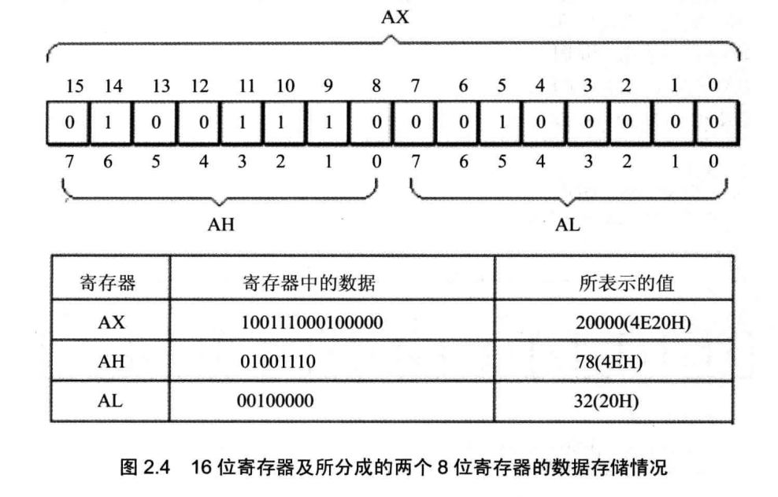  

## 2.2 字在寄存器中的存储
8086CPU可以一次性处理以下两种尺寸的数据：
- 字节：记为byte，一个字节由8个bit组成，可以存在8位寄存器中；
- 字：  记为word，一个字由两个字节，也就是16个bit组成，这两个字节分别成为这个字的*高位字节*和*低位字节*，如图2.5所示。

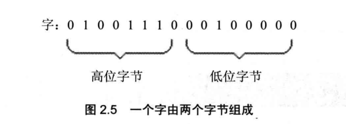

一个字可以存在一个16位寄存器中，这个字的高位字节和低位字节就存在这个寄存器的高8位寄存器和低8位寄存器中。

## 2.3 几条汇编指令
通过表2.1中所列的汇编指令，可以让CPU进行工作。

表2.1 汇编指令举例

|汇编指令|控制CPU完成的操作|用高级语言的语法描述|
|:---|:---|:---|
|MOV AX, 18|将18送入寄存器AX|AX = 18|
|MOV AH, 78|将78送入寄存器AH|AH = 78|
|ADD AX, 8|将寄存器AX中的数值加上8|AX = AX + 8|
|MOV AX, BX|将寄存器BX中的数据送入寄存器AX|AX = BX|
|ADD AX, BX|将AX和BX中的数值相加，结果存在AX|AX = AX + BX|

*注意*：在些一条汇编指令或一个寄存器的名称时，**不区分大小写。**

CPU执行表2.2中所列的程序段中的每条指令后，对寄存器中数据进行的改变如表2.2右侧的列所示。  

表2.2 程序段中指令的执行情况之一（原AX中AX中的值：0000H，原BX中的值：0000H）

|程序段中的指令|指令执行后AX中的数据|指令执行后BX中的数据|
|:---|:---|:---|
|MOV AX, 4E20H|4E20H|0000H|
|ADD AX, 1406H|6226H|0000H|
|MOV BX, 2000H|6226H|2000H|
|ADD AX, BX|8226H|2000H|
|MOV BX, AX|8226H|8226H|
|ADD AX, BX|044CH|8226H|

最后一条中，AX中数值本应为1044CH，但AX只能存储16bit，即4位16进制数据，所以“1”丢失，AX实际存储的值为*044CH*。

表2.3中所列的一段程序的执行情况。
  

|程序段中的指令|指令执行后AX中的数据|指令执行后BX中的数据|
|:---|:---|:---|
|MOV AX, 001AH|001AH|0000H|
|MOV BX, 0026H|001AH|0026H|
|ADD AL, BL|0040H|0026H|
|ADD AH, BL|2640H|0026H|
|ADD BH, AL|2640H|4026H|
|MOV AH, 0|0040H|4026H|
|ADD AL, 85H|00C5H|4026H|
|ADD AL, 93H|0058H|4026H|

最后一条中，AL中数值本应为158H，但AL是8为存储器，“1”丢失（此时并不真正丢失，后续章节再进行讨论）。  
*注意*：虽然AL，AH同属AX，但此时AL作为单独的8位寄存器使用，和AH无关，不会将进位加到AH。

## 2.4 物理地址
CPU访问内存单元时，要给出内存单元的地址。  
所有内存单元构成的存储空间是一个一维的线性空间，每一个内存单元在这个空间中有位移的地址，这个唯一的地址被称为*物理地址*。

## 2.5 16位结构的CPU

# 第三章
